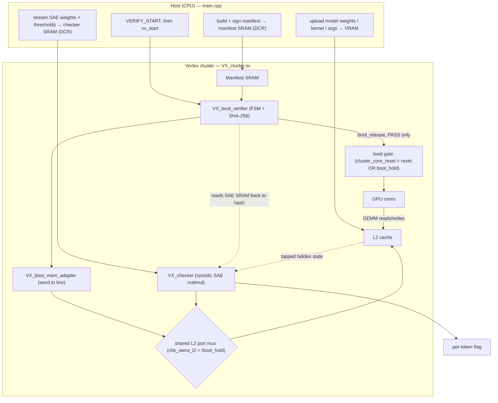
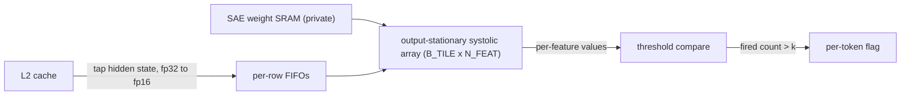

# Measured Models: Non-Bypassable Hardware Semantic Checking

A research fork of [Vortex](https://github.com/vortexgpgpu/vortex).
The base GPU, build system, toolchain, and runtime are all Vortex — credit goes to the Vortex authors (MICRO'21); their original README
is preserved verbatim at [README.upstream.md](README.upstream.md).

This page covers only the additions made in this fork: the non-bypassable
semantic checker (VX_checker), boot-time runtime image verification (VX_boot_verifier), 
the SHA-256 core, the manifest format, and the two regression tests. 

This fork adds two main hardware mechanisms on top of the Vortex GPGPU:

1. **A sparse auto-encoder accelerator**: a systolic array that taps the
   model's hidden state directly off L2, runs a selected-feature SAE matmul + threshold in parallel with the main datapath, and raises a per-token flag. 
2. **Boot-time attestation / verified launch**: before the cores are
   allowed to execute, hardware independently hashes the model weights, kernel,
   kernel args, and the SAE weights/thresholds, and checks them (plus a signature)
   against a signed manifest. Cores are held in reset until every hash matches;
   a tampered image never runs.

---

## File Walkthrough

| File | Purpose |
|------|---------|
| hw/rtl/core/VX_checker.sv | Semantic checker: L2 snoop and output-stationary systolic sparse auto-encoder accelerator. |
| hw/rtl/core/VX_boot_verifier.sv | Boot verifier FSM: walks the signed manifest, hashes each region, compares, gates boot |
| hw/rtl/core/VX_boot_mem_adapter.sv | Adapter for the verifier's VRAM reads and status write |
| hw/rtl/libs/VX_sha256.sv | Streaming SHA-256 core, one 512-bit block / 64 cycles |
| hw/rtl/VX_attest_pkg.sv | Manifest layout package |
| hw/rtl/VX_cluster.sv | CHECKER_ENABLE block adds checker control registers and L1 to L2 bus tap; ATTEST_ENABLE block adds manifest SRAM, verifier/adapter instances, shared-L2-port mux, and boot gate |
| hw/rtl/VX_types.vh | VX_DCR_CHECKER_* and VX_DCR_ATTEST_* device-control registers |
| tests/regression/checker_test/ | Host + kernel test for the checker ([README](tests/regression/checker_test/README.md)) |
| tests/regression/attest_test/ | End-to-end execution image verification test: signed manifest verification, boot gate, and GEMM ([README](tests/regression/attest_test/README.md)) |

The RTL necessary for each test are behind compile-time flags (-DCHECKER_ENABLE,-DATTEST_ENABLE)
and are absent from the default build, so the upstream GPU is unchanged unless you
opt in.

---

## Architecture

### System overview

The verifier and the checker **time-share one L2 port**: the verifier owns it while
the cores are held in reset (during attestation), and hands it to the checker the
instant boot is released. They never overlap in time, so this costs one mux, not a
second port.



### Boot verifier FSM (Task C)

On an arm edge the verifier walks the manifest header, then loops over every
attested region — **signature → kernel → args → SAE weights → SAE thresholds →
each per-layer weight region** — hashing each through the single SHA-256 core and
comparing to the manifest's stored hash. The **first mismatch aborts** with a fail
code (and layer index for weights). `boot_release` is asserted only on the
all-pass path, so it is structurally impossible to release the cores without every
check having passed — the non-bypassability argument, in RTL.

```mermaid
stateDiagram-v2
  [*] --> IDLE
  IDLE --> HEADER: start (arm edge after reset)
  HEADER --> STATUS: magic / version bad
  HEADER --> CHECK: header OK
  state CHECK {
    [*] --> DISPATCH
    DISPATCH --> SETUP: pick region (addr/len/hash)
    SETUP --> HASH: stream bytes to SHA-256
    HASH --> COMPARE: digest vs manifest hash
    COMPARE --> [*]
  }
  CHECK --> NEXT: match
  CHECK --> STATUS: mismatch (FAIL code[,layer])
  NEXT --> CHECK: more regions
  NEXT --> STATUS: all regions passed
  STATUS --> DONE: write status word; boot_release if PASS
  DONE --> [*]
```



The check order matters: the **signature is verified first** (it covers the whole
manifest body, so every stored address and hash is authenticated before the
verifier trusts them). Content regions are hashed afterward, so tampering with the
*device data* after signing is caught by that region's own hash with per-layer
localization. See [`hw/rtl/core/VX_boot_verifier.sv`](hw/rtl/core/VX_boot_verifier.sv)
for the full state machine.

### Semantic checker (Task B)

The checker is an **output-stationary systolic array** (default `B_TILE × N_FEAT`
= 4 × 16 PEs). Each PE holds one accumulator stationary across all `K` hidden
dimensions; activations flow rightward, SAE decoder weights flow downward, and the
indices always meet. After `K + skew` cycles the accumulators complete, go through
a per-feature threshold, and a token is flagged when its fired-feature count
exceeds `k`. The SAE weights live in a **private SRAM** with no model read/write
path, so they can't be profiled or forged.



See [`hw/rtl/core/VX_checker.sv`](hw/rtl/core/VX_checker.sv) and the
[checker_test README](tests/regression/checker_test/README.md) for the dataflow
and skew details.

---

## Environment setup (one-time)

Vortex uses an **out-of-tree build** (everything lives under `build/`). From a
fresh clone:

```sh
# 1. submodules (softfloat, ramulator, cvfpu, hardfloat) — required
git submodule update --init --recursive

# 2. system dependencies (Ubuntu; needs root/sudo)
./ci/install_dependencies.sh

# 3. create the build dir and configure
mkdir -p build && cd build
../configure --xlen=32 --tooldir=$HOME/tools

# 4. install the prebuilt toolchain: RISC-V GNU + LLVM + Verilator (large, one-time)
./ci/toolchain_install.sh --all
```

Then, in **every new shell**, source the toolchain environment:

```sh
cd build
source ./ci/toolchain_env.sh   # sets PATH/vars for RISC-V clang, Verilator, etc.
```

Build the two support libraries once (the rtlsim driver and the GPU kernels link
these). **Do not run the top-level `make`** — it also builds the OPAE/XRT FPGA
shims these tests never use and can exhaust a small or emulated host:

```sh
# from build/, with toolchain_env sourced
make -C ../third_party    # softfloat + ramulator libs (rtlsim driver links these)
make -C kernel            # kernel/libvortex.a (GPU-side runtime the kernel links)
```

**Python** (for the test harnesses): Python ≥ 3.8. `checker_test`'s harness needs
NumPy; `attest_test`'s is stdlib-only.

```sh
apt-get install -y python3-numpy   # or: pip3 install numpy
```

These dependencies are baked into `Dockerfile.dev`, so a freshly built dev image
already has them.

---

## Running the tests

Both tests run under the `rtlsim` (Verilator) driver, which simulates the actual
RTL. The first run Verilates + compiles the driver (~10–25 min under emulation);
it's cached afterward.

### checker_test — the semantic checker

```sh
# from build/, toolchain sourced
CONFIGS="-DCHECKER_ENABLE" make -s -j4        # build the RTL with the checker (once)
python3 ../tests/regression/checker_test/run_tests.py   # correctness sweep
```

Full flag/mode reference and the weight/threshold loading model:
**[tests/regression/checker_test/README.md](tests/regression/checker_test/README.md)**.

### attest_test — boot attestation end-to-end

Exercises the whole chain: attest weights/kernel/args/SAE → release boot → GEMM
runs → checker taps the GEMM output. A valid manifest runs the GEMM; any tamper
blocks it.

```sh
# from build/, toolchain sourced
python3 ../tests/regression/attest_test/run_tests.py                 # valid + all tampers
python3 ../tests/regression/attest_test/run_tests.py --cases none    # valid case only (fastest first check)
```

Tamper modes, status codes, and the pass/fail signal:
**[tests/regression/attest_test/README.md](tests/regression/attest_test/README.md)**.

---

## Design docs

The full design rationale (threat model, manifest format, phased Ed25519 plan,
experiment matrix) lives in [`CLAUDE.md`](CLAUDE.md) under
"Research Paper: Non-Bypassable Hardware Semantic Checking" and
"Boot-Time Attestation / Verified Launch".
